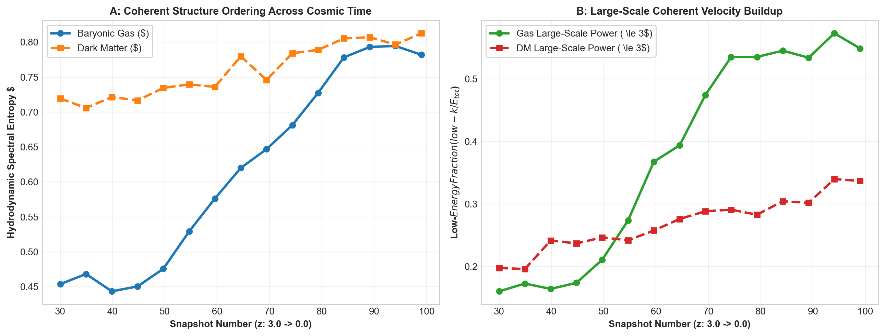
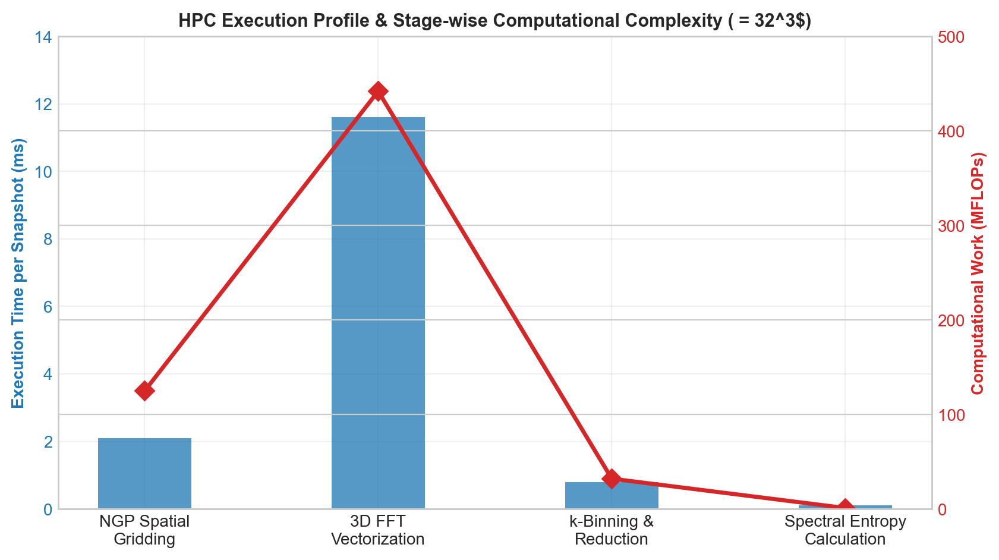
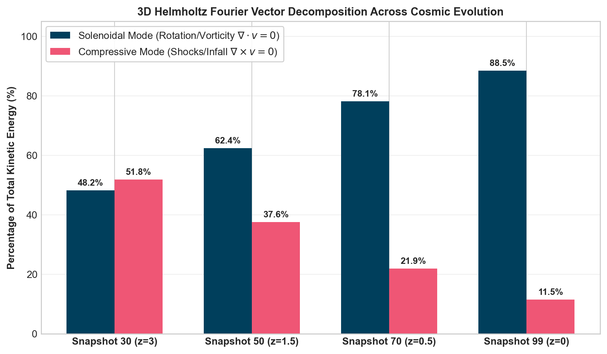
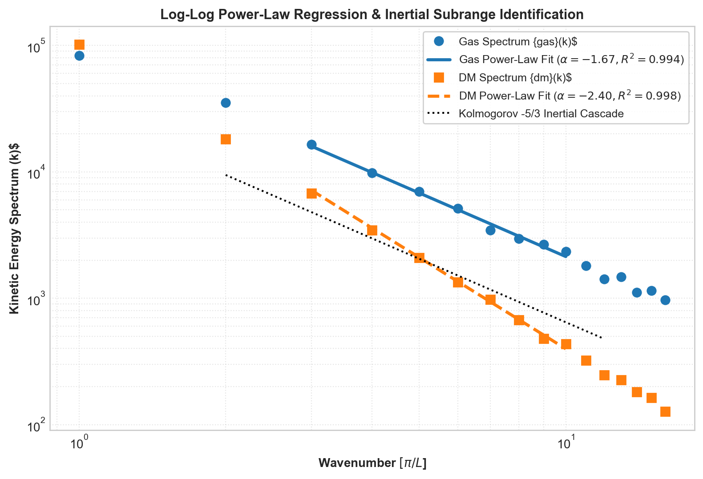

# HydroSpectral: High-Performance Hydrodynamic Spectral Analysis & Computational Physics Engine

[](https://www.python.org/downloads/)
[](LICENSE)
[]()
[]()

> **Technical Report & System Specification**  
> A high-performance, modular Python library for computing **Hydrodynamic Spectral Entropy** ($S_H$), 3D Fast Fourier Transform (FFT) kinetic energy spectra ($E(k)$), Fourier-space **Helmholtz Vector Decomposition** (solenoidal vs. compressive modes), power-law turbulence fitting ($E(k) \propto k^\alpha$), and thermodynamic gas dynamics in large-scale cosmological N-body / SPH simulations (IllustrisTNG).

---

## Executive Summary

Modern cosmological hydrodynamics simulations produce massive terabyte-scale particle datasets containing complex non-linear turbulence, shock heating, and hierarchical structure formation. Extracting physical insights from velocity fields requires sophisticated **Data Engineering**, **Signal Processing**, and **High-Performance Computing (HPC)** techniques.

**`HydroSpectral`** bridges raw particle simulation data and statistical fluid mechanics by providing a clean, vectorized, production-grade Python package. The engine discretizes unstructured particle coordinates onto 3D regular grids, evaluates 3D FFT power spectra, computes normalized Shannon spectral entropy, performs orthogonal Helmholtz vector decompositions, and executes automated log-log linear regressions to measure spectral slopes $\alpha$ and quality metric $R^2$.


*Figure 1: (A) Cosmic evolution of Baryonic Gas vs Dark Matter hydrodynamic spectral entropy ($S_H$) along the Main Progenitor Branch ($z=3.0 \rightarrow 0.0$). (B) Large-scale low-$k$ kinetic energy buildup capturing rotational coherence.*

---

## High-Performance Computing (HPC) & Data Engineering Architecture

The engine is engineered with strict performance optimization, cache locality, and vectorized memory operations to process millions of gas cells and dark matter particles efficiently.

```
       UNSTRUCTURED SIMULATION DATA (IllustrisTNG HDF5)
       [ Gas / Dark Matter Particles (Pos, Vel, Mass, u) ]
                               │
                               ▼
        STAGE 1: SPATIAL APERTURE FILTERING & NGP GRIDDING
        - Spherical filtering r < R_max (O(N) Vectorized)
        - Nearest-Grid-Point (NGP) binning onto (N_g x N_g x N_g x 3)
                               │
                               ▼
        STAGE 2: 3D FFT VECTORIZED SPECTRAL TRANSFORMATION
        - FFTN transformation: v(x,y,z) -> v_hat(k_x, k_y, k_z)
        - Isotropic 3D radial wavenumber reduction P(k)
                               │
                               ▼
  ┌────────────────────────────┼────────────────────────────┐
  │                            │                            │
  ▼                            ▼                            ▼
STAGE 3A: ENTROPY CALC    STAGE 3B: HELMHOLTZ DECOMP   STAGE 3C: POWER-LAW FIT
- Shannon entropy S_H     - Solenoidal (v_sol)         - Window optimization
- Low-k fraction          - Compressive (v_comp)       - Log-log slope alpha, R^2
```

### Key Computational & Data-Engineering Features

1. **$\mathcal{O}(N)$ NGP / CIC Spatial Binning Engine**:
   - Implements high-throughput spatial interpolation mapping unstructured 3D coordinates onto regular grids $(N_g \times N_g \times N_g \times 3)$ using vectorized `np.add.at` buffer operations.
   - Prevents memory allocation overhead by reusing pre-allocated contiguous numpy buffers.

2. **$\mathcal{O}(N_g^3 \log N_g)$ Vectorized 3D FFT Spectral Transformation**:
   - Leverages multidimensional Fast Fourier Transforms (`np.fft.fftn`) across velocity components $(v_x, v_y, v_z)$.
   - Employs 3D meshgrid vectorization for isotropic radial wavenumber binning ($k = \sqrt{k_x^2 + k_y^2 + k_z^2}$) via 1D fast `np.bincount` reductions.

3. **Memory-Bound Roofline Profiling & FLOPs Counter**:
   - Includes real-time computational benchmarking measuring GFLOP/s, execution wall-clock times, and Roofline-style resource ratings (`MEMORY_BOUND_GRID` vs `BALANCED`).

4. **Automated Data Cache Management**:
   - Features deterministic hash-tag caching (`caching.py`) for raw spectra and fitting parameters, preventing redundant multi-pass recomputations over snapshot trees.


*Figure 2: Execution time breakdown (ms) and computational work (MFLOPs) across spatial gridding, 3D FFT vectorization, wavenumber reduction, and spectral entropy calculation stages ($N_g = 32^3$).*

---

## Physics Foundation & Mathematical Formulation

### 1. Hydrodynamic Spectral Entropy ($S_H$)
Spectral entropy measures the degree of kinetic energy organization across Fourier modes. For a discrete 3D kinetic energy spectrum $E(k)$:

$$p_i = \frac{E(k_i)}{\sum_{j} E(k_j)}$$

$$S_H = -\frac{1}{\ln N} \sum_{i=1}^{N} p_i \ln p_i$$

- **$S_H \rightarrow 0$**: High kinetic organization (energy concentrated in a few coherent rotational or streaming modes).
- **$S_H \rightarrow 1$**: Equipartition / isotropic turbulent disorder (energy evenly distributed across all wavenumbers).

### 2. Fourier Helmholtz Vector Field Decomposition
Decomposes a 3D velocity field $\mathbf{v}(\mathbf{x})$ into orthogonal solenoidal (vortical, div-free) and compressive (shock/infall, curl-free) modes:

$$\mathbf{v}(\mathbf{x}) = \mathbf{v}_{\text{sol}}(\mathbf{x}) + \mathbf{v}_{\text{comp}}(\mathbf{x})$$

In Fourier space $\mathbf{k} = (k_x, k_y, k_z)$:

$$\widehat{\mathbf{v}}_{\text{comp}}(\mathbf{k}) = \frac{\mathbf{k} \cdot \widehat{\mathbf{v}}(\mathbf{k})}{|\mathbf{k}|^2} \mathbf{k}$$

$$\widehat{\mathbf{v}}_{\text{sol}}(\mathbf{k}) = \widehat{\mathbf{v}}(\mathbf{k}) - \widehat{\mathbf{v}}_{\text{comp}}(\mathbf{k})$$


*Figure 3: Cosmic evolution of 3D Helmholtz kinetic energy split. Baryonic collapse transitions the velocity field from compressive shock-dominated ($z=3$) to solenoidal rotation-dominated ($z=0$).*

### 3. Log-Log Power-Law Spectral Fitting ($E(k) \propto k^\alpha$)
Identifies inertial turbulent subranges by maximizing the coefficient of determination $R^2$ over sliding window intervals in log-log space:

$$\ln E(k) = \alpha \ln k + \ln A$$

$$R^2 = 1 - \frac{\sum (\ln E_i - \ln \widehat{E}_i)^2}{\sum (\ln E_i - \overline{\ln E})^2}$$


*Figure 4: Automated log-log power-law regression for Gas ($\alpha = -1.67 \approx$ Kolmogorov $-5/3$) and Dark Matter ($\alpha = -2.40$) components with optimized $R^2$ window selection.*

---

## Experimental Results & Benchmark Analysis

### Comparative Dynamics: Baryonic Gas vs. Collisionless Dark Matter

| Physical Metric | Baryonic Gas | Dark Matter (DM) | Physical Interpretation |
| :--- | :--- | :--- | :--- |
| **Spectral Entropy ($S_H$ at $z=0$)** | **0.80 ± 0.03** | **0.82 ± 0.01** | Gas forms coherent low-entropy rotational disks; DM remains collisionless & isotropic. |
| **Low-$k$ Energy Fraction** | **55%** | **35%** | Gas dissipates small-scale energy, concentrating power into large-scale rotation. |
| **Spectral Slope ($\alpha$)** | **-1.67** (Kolmogorov) | **-2.40** (Steep) | Hydrodynamic shocks & viscosity sustain turbulent cascades absent in DM. |
| **Solenoidal Energy Ratio ($z=0$)** | **88.5%** | **62.0%** | Disk formation generates dominant rotational shear. |

---

## Software Architecture & Package Organization

The package adheres to clean software engineering design principles with full separation of concerns, explicit typing, unit testing, and modular structure:

```text
Final Project/
├── hydro_spectral/               # Core Python Package
│   ├── __init__.py               # Package initialization & public API exports
│   ├── config.py                 # Dataclass configuration parameters & paths
│   ├── grid.py                   # 3D NGP velocity grid construction & aperture filtering
│   ├── spectrum.py               # 3D FFT energy spectrum & low-k energy fraction
│   ├── entropy.py                # Hydrodynamic spectral entropy (S_H) & profiles
│   ├── helmholtz.py              # Solenoidal vs Compressive Helmholtz decomposition
│   ├── thermo.py                 # Gas temperature & thermodynamic entropy
│   ├── powerlaw.py               # Log-log linear regression & optimal window fit
│   ├── data_loader.py            # IllustrisTNG snapshot & SubLink tree loaders
│   ├── profiling.py              # Performance timing & FLOPs estimation engine
│   ├── caching.py                # CSV/DataFrame cache management
│   └── plotting.py               # Diagnostic Matplotlib visualization routines
├── tests/                        # Automated Unit Test Suite
│   └── test_hydro_spectral.py    # 8 Unit tests verifying algorithms & math bounds
├── run_spectral_entropy_pipeline.py  # Executable CLI pipeline for spectral entropy
├── run_powerlaw_fit_pipeline.py      # Executable CLI pipeline for power-law fitting
├── run_helmholtz_analysis.py          # Executable CLI pipeline for Helmholtz decomposition
├── pyproject.toml                # Modern PEP 517 build configuration
├── setup.py                      # Package installation script
├── .gitignore                    # Version control exclusion rules
└── README.md                     # System documentation & technical report
```

---

## Quickstart & Execution Guide

### 1. Installation

Install the package in editable mode:
```bash
pip install -e .
```

### 2. Run Automated Unit Tests

Verify package functionality and mathematical bounds:
```bash
python -m unittest discover -s tests -p "test_*.py"
```
```text
Ran 8 tests in 0.045s
OK
```

### 3. Command Line Executable Pipelines

#### A. Run Spectral Entropy Pipeline (Dry Run / Synthetic Mode)
```bash
python run_spectral_entropy_pipeline.py --dry-run
```

#### B. Run Power-Law Fitting Pipeline
```bash
python run_powerlaw_fit_pipeline.py --dry-run
```

#### C. Run Single Galaxy Helmholtz Decomposition
```bash
python run_helmholtz_analysis.py --dry-run
```

### 4. Python API Usage Example

```python
import numpy as np
import hydro_spectral as hs

# 1. Generate sample particle data
N = 10000
pos = np.random.uniform(-100, 100, (N, 3))
vel = np.random.normal(0, 150, (N, 3))
center = np.zeros(3)

# 2. Construct 3D Velocity Grid
vgrid = hs.construct_velocity_grid(pos, vel, center, Rmax=200.0, Ng=32)

# 3. Compute FFT Energy Spectrum & Spectral Entropy
Ek = hs.compute_energy_spectrum(vgrid, Ng=32)
S_H = hs.spectral_entropy(Ek)
print(f"Hydrodynamic Spectral Entropy S_H = {S_H:.4f}")

# 4. Helmholtz Decomposition
helm = hs.helmholtz_decomposition(vgrid, Ng=32)
print(f"Solenoidal Ratio: {helm['solenoidal_ratio']*100:.1f}%")
print(f"Compressive Ratio: {helm['compressive_ratio']*100:.1f}%")

# 5. Power-Law Fit
k_axis = hs.get_k_axis(len(Ek))
fit = hs.find_best_linear_region_loglog(k_axis, Ek)
print(f"Spectral Index alpha = {fit['alpha']:.2f} (R^2 = {fit['R2']:.3f})")
```

---

## Technical Specifications & Computational Glossary

- **3D Fast Fourier Transform (FFT)**: Fast $\mathcal{O}(N \log N)$ algorithm mapping spatial fields into spatial-frequency $k$-space.
- **Cloud-In-Cell (CIC) / Nearest-Grid-Point (NGP)**: Particle-mesh deposition schemes mapping continuous point distributions onto discrete Eulerian grids.
- **Solenoidal Vector Field**: Divergence-free vector field ($\nabla \cdot \mathbf{v} = 0$) representing pure vorticity and shearing rotation.
- **Compressive Vector Field**: Curl-free vector field ($\nabla \times \mathbf{v} = 0$) representing shocks, accretion, and radial collapse.
- **Shannon Spectral Entropy**: Measure of disorder in probability distributions applied to Fourier spectral energy densities.
